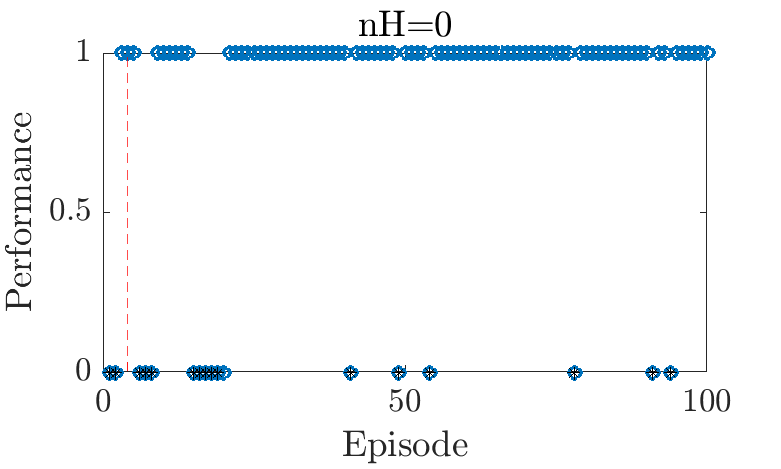
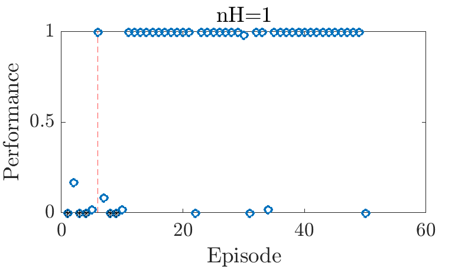
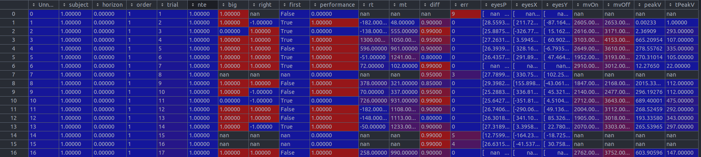

# Behavioral Analysis Preprocessing Pipeline
Authors: Gloria Cecchini (MATLAB preprocessing scripts), Michael DePass (.mat to .csv Python script)
## Contents
1. MySQL database (.sql) for storing data 
2. MATLAB scripts (.m) for behavioral data preprocessing
    - Import and organize .bhv2 MonkeyLogic files
    - Write data to MySQL database 
    - Load data from MySQL database
    - Plot behavior data including decisions & oculometry
    - Export data to .mat file 
3. .mat to .csv Python conversion script ideal for import to Pandas dataframe.
4. [Link to raw data](https://drive.google.com/drive/folders/1I9lFkNSw71a0NRWHtM_x7pKMZz-m4sxR?usp=sharing) and inputs/outputs for the scripts. 

### MATLAB Pipeline Instructions
0. Import empty database (MySQL_coredembcn_baseline.sql) to MySQL 
1. Set working directory to directory containing Main.m
2. Open Main.m and execute
3. You will be prompted to select the folder where the raw data are saved
    - Data collected at UB as well as inputs and outputs of the scripts can be found [here](https://drive.google.com/drive/folders/1I9lFkNSw71a0NRWHtM_x7pKMZz-m4sxR?usp=sharing). (Note: folders to be processed must be unzipped first!)
4. You will be prompted to provide your MySQL username as a string e.g. 'Gloria'
5. You will be prompted to input the 2 digit subject number of the folder to upload
   - When you are done with the upload, input 1.
6. Continuing follow instructions in the prompts.
   - When asked "Do you want to include all participants?", this refers to whether you want to continue plotting all uploaded particpipants or a subset (array containing indices of desired subjects for plotting). 
   - Note: Only last 18 participants have oculometry data. 
   
*Direct questions regarding MATLAB pipeline to gloria.cecchini@ub.edu*

### mat2csv
Input: aggregate .mat file (output from Main.m)
Output: Pandas-ready .csv file
1. Edit mat_file_name and csv_file_name variables as appropriate. 
2. Execute

*Direct questions regarding mat2csv to michael.depass@ub.edu*

### Example Output
Example decisions plotted for Horizons 0 and 1 of the Consequential task:
| Horizon 1                           |                           Horizon 2 |
|-------------------------------------|-------------------------------------|
|   |   |

Example Pandas DataFrame after conversion to .csv:

